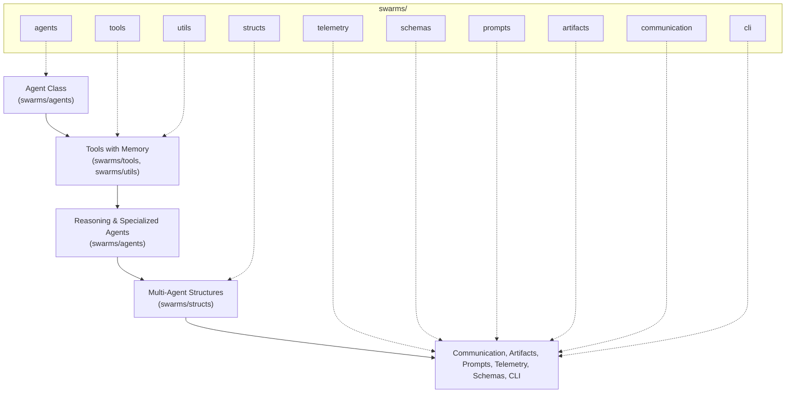

Swarms is an enterprise-grade, production-ready multi-agent orchestration framework. It enables developers and organizations to build, deploy, and manage intelligent agents that can reason, collaborate, and solve complex tasks autonomously or in groups. The architecture is inspired by the principles of modularity, composability, and scalability, ensuring that each component can be extended or replaced as needed.

The protocol is structured to support a wide range of use cases, from simple single-agent automations to sophisticated multi-agent workflows involving memory, tool use, and advanced reasoning.

---

## High-Level Architecture Flow

The Swarms protocol is organized into several key layers, each responsible for a specific aspect of the system. The typical flow is as follows:

### 1. Agent Class (`swarms/agents`)

The core building block of the framework. Agents encapsulate logic, state, and behavior. They can be simple (stateless) or complex (stateful, with memory and reasoning capabilities).

- Agents can be specialized for different tasks (e.g., reasoning agents, tool agents, judge agents, etc.)
- Example: A `ReasoningAgent` that can analyze data and make decisions, or a `ToolAgent` that wraps external APIs

### 2. Tools with Memory (`swarms/tools`, `swarms/utils`)

Tools are modular components that agents use to interact with the outside world, perform computations, or access resources (APIs, databases, files, etc.).

- Memory modules and utility functions allow agents to retain context, cache results, and manage state across interactions
- Example: A tool for calling an LLM API, a memory cache for conversation history, or a utility for parsing and formatting data

### 3. Reasoning & Specialized Agents (`swarms/agents`)

These agents build on the base agent class, adding advanced reasoning, self-consistency, and specialized logic for tasks like planning, evaluation, or multi-step workflows.

- Includes agents for self-reflection, iterative improvement, and domain-specific expertise
- Example: A `SelfConsistencyAgent` that aggregates multiple reasoning paths, or a `JudgeAgent` that evaluates outputs from other agents

### 4. Multi-Agent Structures (`swarms/structs`)

Agents are composed into higher-order structures for collaboration, voting, parallelism, and workflow orchestration.

- Includes swarms for majority voting, round-robin execution, hierarchical delegation, and more
- Example: A `MajorityVotingSwarm` that aggregates outputs from several agents, or a `HierarchicalSwarm` that delegates tasks to sub-agents

### 5. Supporting Components

- **Communication (`swarms/communication`)**: Provides wrappers for inter-agent communication, database access, message passing, and integration with external systems (e.g., Redis, DuckDB, Pulsar)
- **Artifacts (`swarms/artifacts`)**: Manages the creation, storage, and retrieval of artifacts (outputs, files, logs) generated by agents and swarms
- **Prompts (`swarms/prompts`)**: Houses prompt templates, system prompts, and agent-specific prompts for LLM-based agents
- **Telemetry (`swarms/telemetry`)**: Handles logging, monitoring, and bootup routines for observability and debugging
- **Schemas (`swarms/schemas`)**: Defines data schemas for agents, tools, completions, and communication protocols
- **CLI (`swarms/cli`)**: Provides command-line utilities for agent creation, management, and orchestration

---

## Proposing Large Improvements: Swarms Improvement Proposals (SIPs)

For significant changes, new agent architectures, or radical new features, Swarms uses a formal process called **Swarms Improvement Proposals (SIPs)**. SIPs are design documents that describe new features, enhancements, or changes to the Swarms framework. They ensure that major changes are well-documented, discussed, and reviewed by the community before implementation.

**When to use a SIP:**

- Proposing new agent types, swarm patterns, or coordination mechanisms
- Core framework changes or breaking changes
- New integrations (LLM providers, tools, external services)
- Any complex or multi-component feature

**SIP Process Overview:**

1. Discuss your idea in [GitHub Discussions](https://github.com/kyegomez/swarms/discussions)
2. Submit a SIP as a GitHub Issue using the SIP template
3. Engage with the community and iterate on your proposal
4. Undergo review and, if accepted, proceed to implementation

See the full [SIP Guidelines](/community/protocol/sips) for more details.

---

## Architecture Diagram

The following diagram visualizes the protocol flow and the relationship between the main folders in the `swarms/` package:

---

## Folder-by-Folder Breakdown

### `agents/`

Defines all agent classes, including base agents, reasoning agents, tool agents, judge agents, and more.

- Modular agent design for extensibility
- Support for YAML-based agent creation and configuration
- Specialized agents for self-consistency, evaluation, and domain-specific tasks

### `tools/`

Houses all tool-related logic, including tool registry, function calling, tool schemas, and integration with external APIs.

- Tools can be dynamically registered and called by agents
- Support for OpenAI function calling, Cohere, and custom tool schemas
- Utilities for parsing, formatting, and executing tool calls

### `structs/`

Implements multi-agent structures, workflows, routers, registries, and orchestration logic.

- Swarms for majority voting, round-robin, hierarchical delegation, spreadsheet processing, and more
- Workflow orchestration (sequential, concurrent, graph-based)
- Utilities for agent matching, rearrangement, and evaluation

### `utils/`

Provides utility functions, memory management, caching, wrappers, and helpers used throughout the framework.

- Memory and caching for agents and tools
- Wrappers for concurrency, logging, and data processing
- General-purpose utilities for string, file, and data manipulation

### `telemetry/`

Handles telemetry, logging, monitoring, and bootup routines for the framework.

- Centralized logging and execution tracking
- Bootup routines for initializing the framework
- Utilities for monitoring agent and swarm performance

### `schemas/`

Defines data schemas for agents, tools, completions, and communication protocols.

- Ensures type safety and consistency across the framework
- Pydantic-based schemas for validation and serialization

### `prompts/`

Contains prompt templates, system prompts, and agent-specific prompts for LLM-based agents.

- Modular prompt design for easy customization
- Support for multi-modal, collaborative, and domain-specific prompts

### `artifacts/`

Manages the creation, storage, and retrieval of artifacts (outputs, files, logs) generated by agents and swarms.

- Artifact management for reproducibility and traceability
- Support for various output types and formats

### `communication/`

Provides wrappers for inter-agent communication, database access, message passing, and integration with external systems.

- Support for Redis, DuckDB, Pulsar, Supabase, and more
- Abstractions for message passing and data exchange between agents

### `cli/`

Command-line utilities for agent creation, management, and orchestration.

- Scripts for onboarding, agent creation, and management
- CLI entry points for interacting with the framework

---

## Swarms Framework Philosophy

Swarms is built on the following principles:

- **Modularity:** Every component (agent, tool, prompt, schema) is a module that can be extended or replaced
- **Composability:** Agents and tools can be composed into larger structures for complex workflows
- **Observability:** Telemetry and artifact management ensure that all actions are traceable and debuggable
- **Extensibility:** New agents, tools, and workflows can be added with minimal friction
- **Production-Readiness:** The framework is designed for reliability, scalability, and real-world deployment

---

## Further Reading

| Resource | Description |
|----------|-------------|
| [Quickstart for Agents](https://docs.swarms.world/en/latest/swarms/agents/) | Getting started with Swarms agents |
| [Agent API Reference](https://docs.swarms.world/en/latest/swarms/structs/agent/) | API reference for the Agent class |
| [Tools Overview](https://docs.swarms.world/en/latest/swarms_tools/overview/) | Overview of available tools |
| [Multi-Agent Architectures](https://docs.swarms.world/en/latest/swarms/concept/swarm_architectures/) | Multi-agent system architectures |
| [SIP Guidelines](/community/protocol/sips) | Swarms Improvement Proposal process and template |
| [Examples Overview](https://docs.swarms.world/en/latest/examples/) | Example projects and use cases |
| [CLI Documentation](https://docs.swarms.world/en/latest/swarms/cli/cli_reference/) | Command-line interface documentation |
